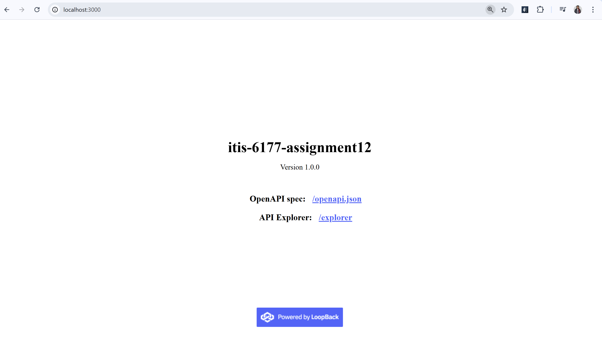

# ITIS-6177 Assignment 12 - Product API with LoopBack 4

## API Overview
REST API for product management with full CRUD operations

## Tool Used
LoopBack 4 (https://loopback.io/)

## Development Steps
1. Installed LoopBack CLI:  
   `npm install -g @loopback/cli`
2. Created application:  
   `lb4 app itis-6177-assignment12`
3. Generated Product model:  
   `lb4 model` (with properties: id, name, price)
4. Created datasource:  
   `lb4 datasource` (selected in-memory database)
5. Built repository:  
   `lb4 repository`
6. Created REST controller:  
   `lb4 controller`

## Features
- In-memory database (no setup required)
- Auto-generated OpenAPI 3.0 documentation
- Complete CRUD endpoints
- Built-in API Explorer

## API Endpoints
| Method | Endpoint | Description |
|--------|----------|-------------|
| POST   | /products | Create new product |
| GET    | /products | List all products |
| GET    | /products/{id} | Get product by ID |
| PUT    | /products/{id} | Replace entire product |
| PATCH  | /products/{id} | Update product fields |
| DELETE | /products/{id} | Delete product |
| GET    | /products/count | Count products |
| PATCH  | /products | Bulk update products |

## Installation & Execution
1. Install dependencies: `npm install`
2. Start server: `npm start`
3. Access at: http://localhost:3000

## Example Endpoints
- GET /products - List all products
- POST /products - Create new product
- GET /products/{id} - Get product by ID

